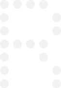
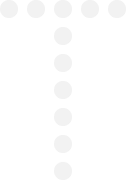

# Spasoje Perovic

 

#

I'm an independent creative developer from Montenegro, dedicated to crafting impactful digital experiences for global brands & individuals. Let's team up!

- [Website](https://www.spasoje.dev/)
- [Awwwards](https://www.awwwards.com/spasoje/)
- [Instagram](https://www.instagram.com/spasoje.perovic)

## 💻 Tech Stack:
                  

## 📊 GitHub Stats:
 
 

## 🏆 GitHub Trophies

